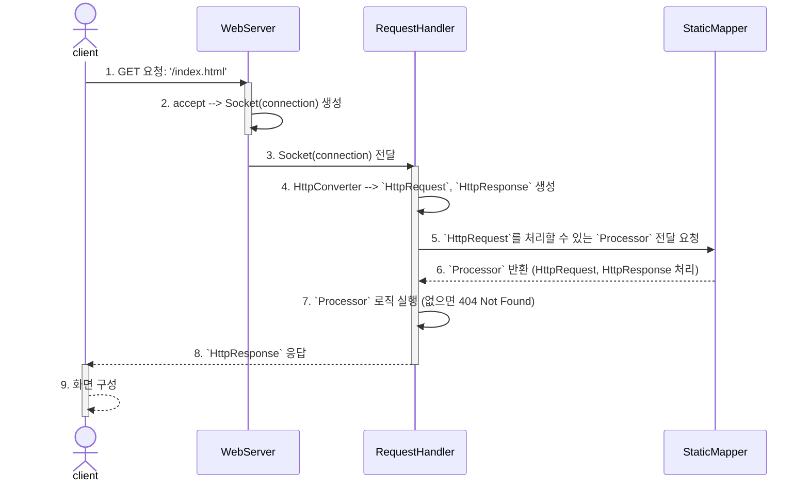

# be-was-2024
코드스쿼드 백엔드 교육용 WAS 2024 개정판

# GitHub Wiki
- 학습 내용 정리: [WAS1 - Wiki](https://github.com/Yeriimii/be-was-neon/wiki/Java-Concurrent-%E2%80%90-CompletableFuture)

# 전체 요청 흐름
## HTTP GET 요청 흐름 (`/index.html`, `/registration`)

# 기능 구현 리스트
## RequestHandler
- [x] 요청 헤더(GET/Host/Connection/Accept)에 대해 파싱하고 로그로 출력할 수 있다
- [x] 'localhost:8080/index.html' 요청에 대해 정적 html을 응답할 수 있다

## HttpHeaderParser
- [x] request line, host, connection 등을 파싱할 수 있다
- [x] 쿼리 파라미터를 파싱해서 Map으로 변환할 수 있다

## HttpRequestConverter
- [x] Socket의 connection으로부터 requestString을 한 줄로 만들 수 있다
- [x] 한 줄의 requestString으로부터 HttpRequest 객체로 컨버팅 할 수 있다

## HttpResponseConverter
- [x] Socket의 connection으로부터 HttpResponse를 생성할 수 있다

## ResourceHandler
- [x] 파일을 읽어 byte로 변환할 수 있다

## StaticMapper
- [x] 요청 URI에 해당하는 정적 파일을 매핑할 수 있다
- [x] 존재하지 않는 URI는 빈 Optional을 반환할 수 있다
